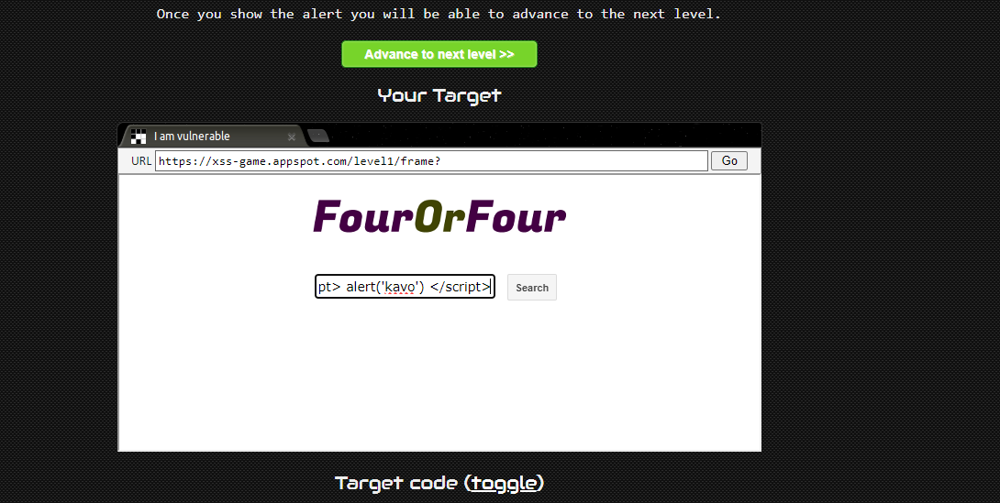
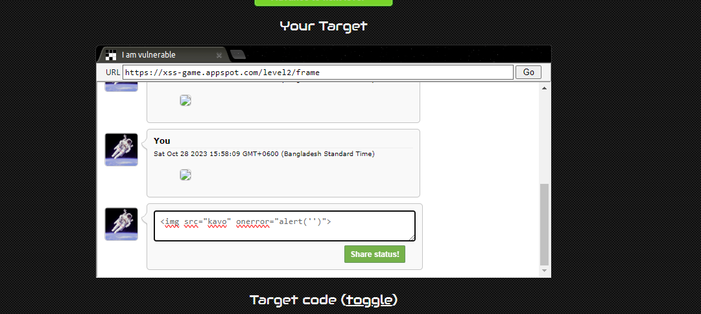
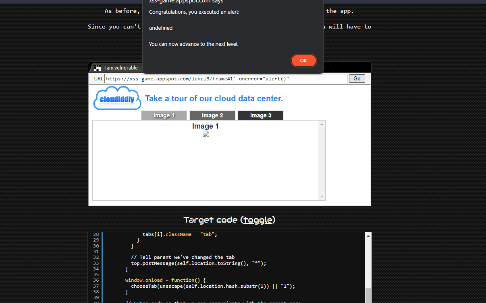
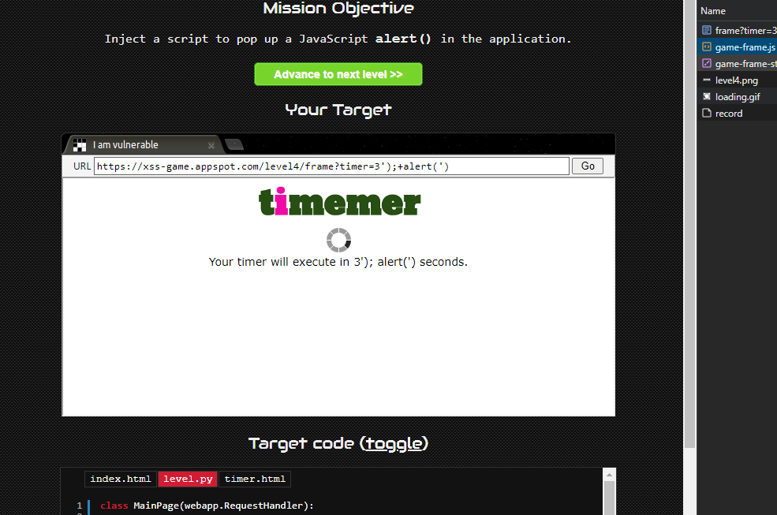
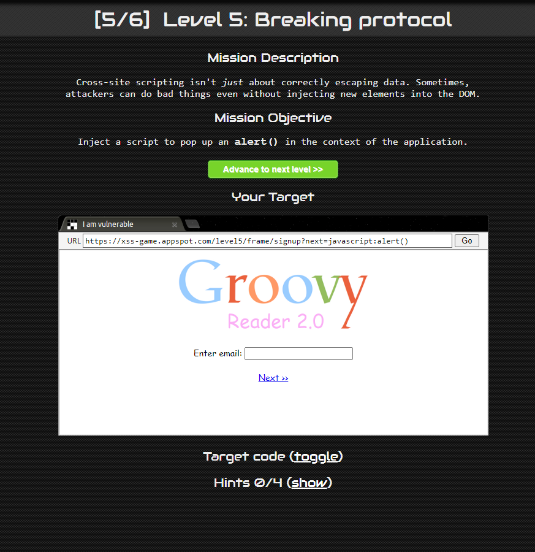
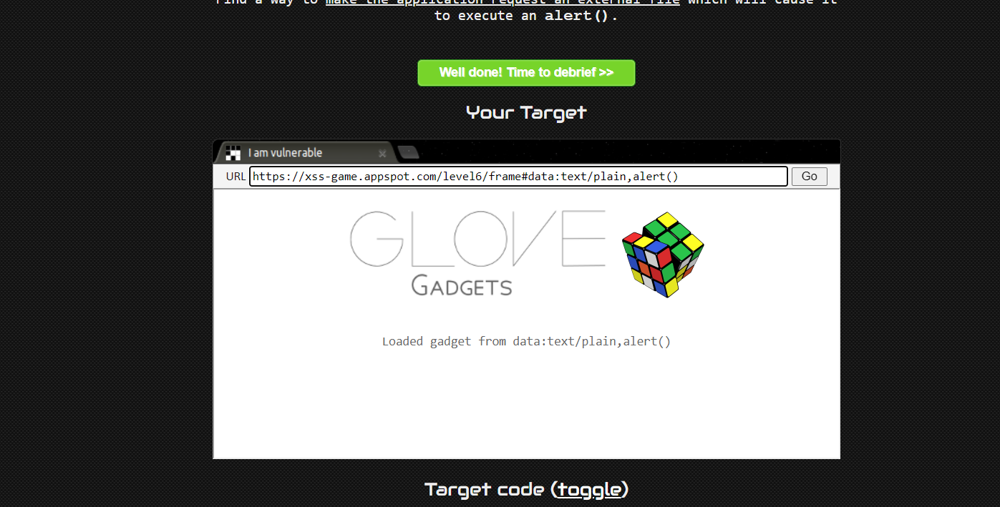

# XSS ATTACKS

(XSS) bugs are one of the most common and dangerous types of vulnerabilities in Web applications. These nasty buggers can allow your enemies to steal or modify user data in your apps

1)  Common cause of XSS is user input directly included in the page without proper escaping! 
   > Insert an XSS payload into your name that, when viewed by another user, will cause an alert box to pop up. This demonstrates a basic stored XSS attack.``  or this `https://xss-game.appspot.com/level1/frame?query=`
2)  Persistence is key
    Web applications often keep user data in server-side and, increasingly, client-side databases and later display it to users. No matter where such user-controlled data comes from, it should be handled carefully.
3) Some common JS functions are execution sinks which means that they will cause the browser to execute any scripts that appear in their input. Sometimes this fact is hidden by higher-level APIs which use one of these functions under the hood.
> The payload you mentioned, frame#1' onerror="alert()", is an example of a URL-based XSS attack. By including this payload in the URL, the onerror attribute is triggered when the frame element is rendered on the page, resulting in an alert being displayed.
> This level illustrates how URL-based XSS attacks can occur when user input is improperly handled in the context of URL parameters, and it's crucial to validate and sanitize input to prevent such attacks.
4) Every bit of user-supplied data must be correctly escaped for the context of the page in which it will appear  
5) Cross-site scripting isn't just about correctly escaping data. Sometimes, attackers can do bad things even without injecting new elements into the DOM. 
6) Complex web applications sometimes have the capability to dynamically load JavaScript libraries based on the value of their URL parameters or part of location.hash. 